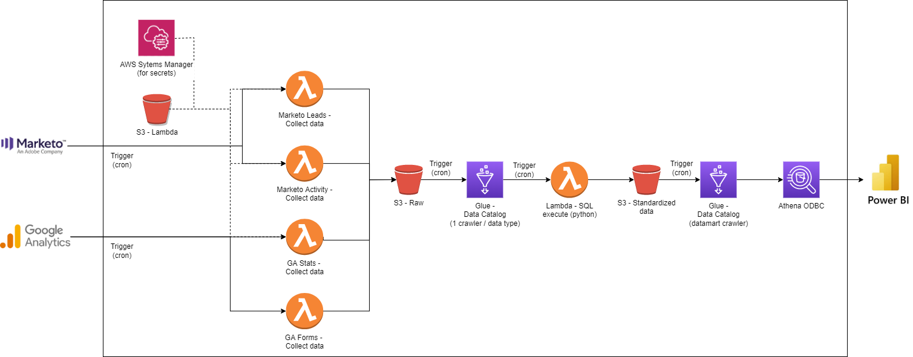

# Creating data pipelines for marketing analytics using AWS Cloud Formation
Tutorial on deploying AWS resources to query and collect Google Analytics and Marketo data using Cloud Formation

*Note : Code used in this repo is for GA3 (UA-XXXXXX using reporting API) and not GA4*

## Architecture

## Choices made
1. Using Lambda functions to query the APIs directly instead of leveraging the AppFlow connectors created for these two sources

    **Reasoning**: The AppFlow connectors are not comprehensive (no segments for Google Analytics; no Activity Id filter for Marketo) and error prone (data flow fails randomly due to malformed responses).

2. Final datamart launched on a schedule to create a table using Athena API, instead of a view

    **Advantage**: For datamarts that will be queried often, for example a dashboard with many users, avoids high costs of running the query on the entirety of the underlying data.
    
    **Alternative**: Using a view instead of a table to aggregate the data from the different sources
     
    **Advantages of Alternative Method**:

     - Data in datamart is independent of the time that the source data is received
     - Does not require an additional step in the data pipeline to run the query  
     - If the dashboard is set to update the data upon demand in the dashboard, high costs will be avoided because each user will likely update the data in the dashboard at most once a day, at their convenience.  

3. Cron vs S3 bucket notification to trigger Glue Crawler
    - Marketo : S3 bucket notification
        - Reasoning : Since all business units use the same Marketo Account, there will only be one marketo activity file and one marketo leads file for each data pipeline launch. As a result, the crawler can be launched as soon as the marketo lambdas are done processing.
    - Google Analytics : Cron
        - Reasoning : Since each of the business units have a unique property view id in Google Analytics, there will be two seperate data transformation instances and multiple file creations per day, making it impractical to launch the crawler after each transformation. For this reason, a cron schedule is used for the Glue Crawler.

## Deploiment process
1. Navigate to the AWS Systems Manager service in your AWS account.
2. Click on *Parameter store* in the lefthand menu bar and create three parameters for ClientId, ClientSecret and MunchkinId (see below) using the orange *Create parameter* buton.
    - Hint : The parameter name should start with a slash (ex. /marketo/ClientId)
    - Since we are storing credentials, check the SecureString option to encrypt the data.
    - Add the value in the *Value* section.
3. Navigate to the Cloud Formation service in your AWS account.
4. Select the orange *Create Stack* button.
5. Keep the *Template is ready* option and select *Upload a template file*
6. Upload the common-resources Cloud Formation stacks (i.e. the yml files). Fill in a unique stack name and the stack parameters (see below).
7. Create a Marketo REST API Lambda layer (see below) and create a Lambda layer in AWS using the zip file with the name *${ProjectName}-${Env}-marketorestpython-layer*
8. Upload the transformation-resources Cloud Formation stacks (i.e. the yml files). Fill in a unique stack name and the stack parameters (see below).  
    *Note : Depending on your region, you might need to change the layer version for the AWS Data Wrangler layer.*

## Parameter dictionary
- **Env** : Your AWS environment type (ex. dev, prod). This will be used in the naming of most of the resources.
- **ProjectName** : The name of your project (ex. dashboard). This will be used in the naming of most of the resources.
- **ClientID** : The SSM path to the Client Id for your Marketo account. This is required for the Marketo API for authentication. Here's a link to [the documentation](https://developers.marketo.com/rest-api/authentication/#:~:text=The%20Client%20ID%20and%20Client,in%20the%20REST%20API%20section.&text=access_token%20%E2%80%93%20The%20token%20that%20you,authenticate%20with%20the%20target%20instance.).
- **ClientSecret** : The SSM path to the Client Id for your Marketo account. This is required for the Marketo API for authentication.
- **MunchkinId** : The SSM path to the Client Id for your Marketo account. This is required for the Marketo API to specify the Marketo account. Here's a link to [how to find your Munchkin Id](https://nation.marketo.com/t5/knowledgebase/how-to-find-your-munchkin-id-for-a-marketo-instance/ta-p/248432)
- **DataLakeDatabaseName** : The name of your new Athena database created by the glue-stack.yml CloudFormation stack.
- **DataLakeGlueRoleArn** : The Arn of your new Glue IAM role created by the glue-stack.yml CloudFormation stack. You can find this in the IAM service of AWS. Search for "glue" in *Roles*.
- **GCPServiceAccountKey** : GCP credentials that allow the Lambda function to query the Google Analytics REST API. [Here's how to generate service account credentials from your GCP account](https://developers.google.com/identity/protocols/oauth2/service-account)
- **RawBucketName** : The name of your new S3 bucket created by the data-storage.yml CloudFormation stack. Used to store raw data from APIs, that will later be used for the datamart.
- **RawDataCollectCron** : The schedule at which you would like your pipeline to query your data sources. Example : *cron(00 01 * * ? *)*
    - [Here's a link to AWS documentation on crons](https://docs.aws.amazon.com/fr_fr/lambda/latest/dg/services-cloudwatchevents-expressions.html)
- **RawDataCrawlCron** : The schedule at which you would like the Glue Crawler to crawl your S3 bucket and update your Athena tables. Depends on the time that you think is necessary to query the data. In our pipeline, the data collection should take at most 5 minutes. Thus, it would be safe to use a cron that is 15 mins after the *RawDataCollectCron* for example.
- **StdBucketName** : The name of your new S3 bucket created by the data-storage.yml CloudFormation stack. Used to store transformed tables, used in dashboards.
- **StdDataCollectCron** : The schedule at which you would like your pipeline to transform your raw data sources.
- **StdDataCrawlCron** : The schedule at which you would like the Glue Crawler to crawl your S3 bucket and update your Athena tables. Depends on the time that you think is necessary to transform the data.

## Creating the Marketo REST API Lambda layer
1. Navigate to the AWS CloudShell
2. Create a folder with the library name : `mkdir marketorestpython`
3. Change directory into that folder : `cd marketorestpython`
4. Create a python subfolder : `mkdir python`
5. Change directory into that folder : `cd python`
6. Dowload the library : `pip3 install marketorestpython -t .`
7. Change directory to the previous level : `cd ..`
8. Package the library : `zip -r marketorestpython_layer.zip .`
9. Copy the library to your S3 bucket : `aws s3 cp marketorestpython_layer.zip s3://${ProjectName}-${Env}-lambda-resources-${AWS::AccountId}-${AWS::Region}`

